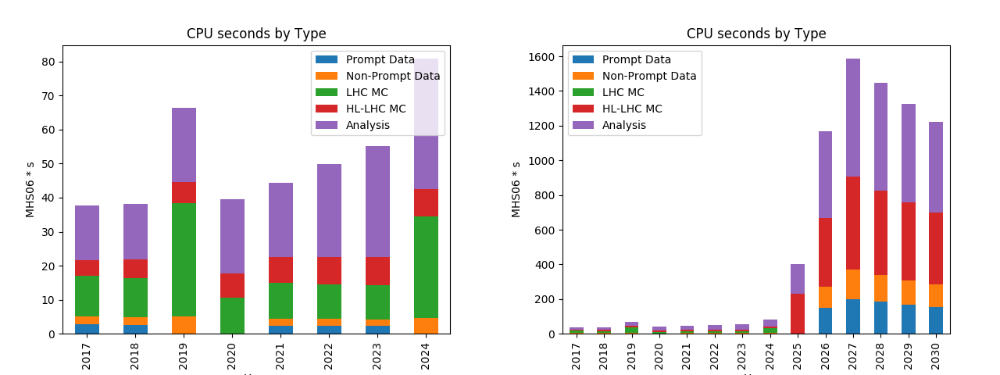
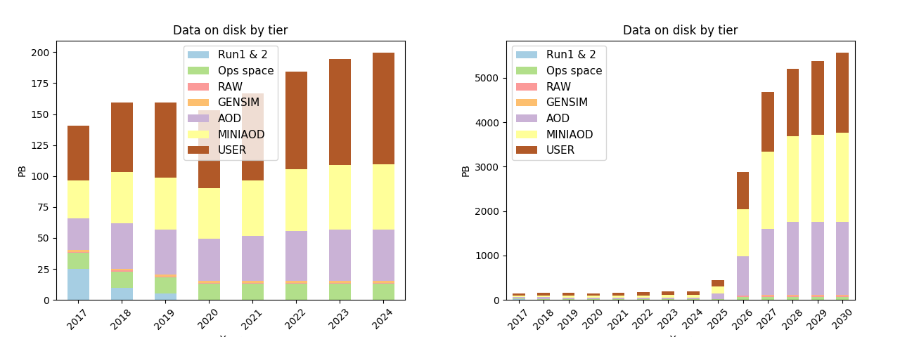
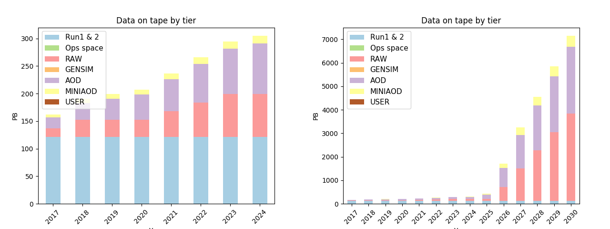

Estimation of CMS Resource Needs
--------------------------------------------

We estimate the yearly CPU time needs of CMS according to the above model, with the results shown in Figure 1. The increases in needs seen in 2019 and 2024 are due to the planned legacy reprocessing of Run 2 and Run 3 data and simulation samples. There is a significant increase in needs at the start of the HL-LHC era, driven by the complexity of reconstruction of collisions of high beam intensities in both recorded and simulated events, and the ten-times increase in HLT output rate.

Figure 2 shows the estimate the disk needs of CMS after calculating the recorded and simulated number of events per year and applying the assumed event sizes per data tier. While disk needs only grow modestly in the LHC era, they are predicted to become unsustainable at the HL-LHC in the current model, even with a fairly aggressive policy of reducing versions and replicas.

The CMS tape needs are estimated with the same model and shown in Figure 3.  We use the tape space occupied by LHC Run 1 and LHC Run 2 years 2015,2016 as Run 1 and Run 2 legacy data and assume that it cannot be reduced any further. We store two RAW copies on tape at different sites.  The tape estimates include using tape for cold storage of AOD and MINIAOD samples.

