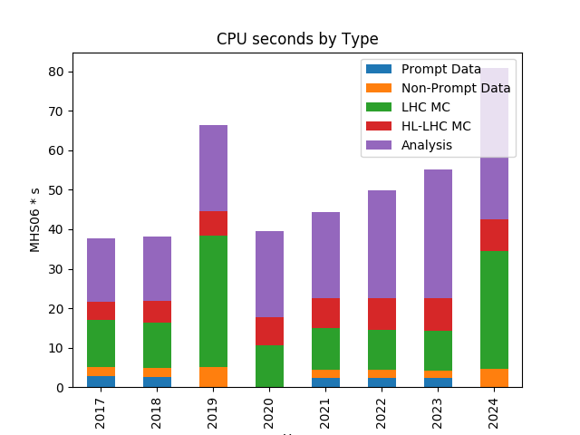
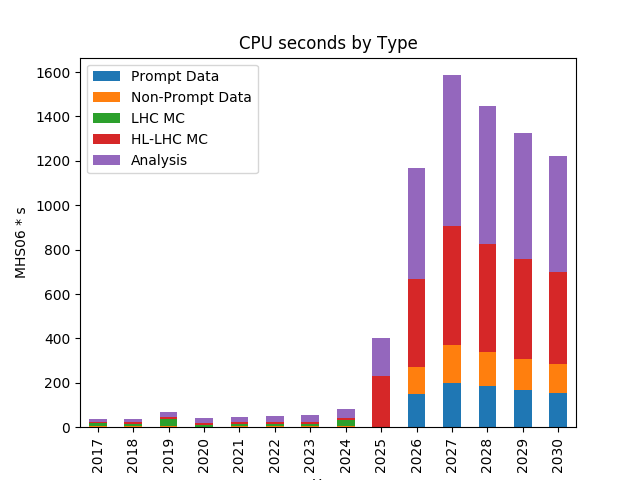

Estimation of CMS Resource Needs
--------------------------------------------

We estimate the yearly CPU time needs of CMS according to the above
model, with the results shown in Figure 1. The increases in needs seen
in 2019 and 2024 are due to the planned legacy reprocessing of Run 2 and
Run 3 data and simulation samples. There is a significant increase in
needs at the start of the HL-LHC era, driven by the complexity of
reconstruction of collisions of high beam intensities in both recorded
and simulated events, and the ten-times increase in HLT output
rate.

[]{style="overflow: hidden; display: inline-block; margin: 0.00px 0.00px; border: 0.00px solid #000000; transform: rotate(0.00rad) translateZ(0px); -webkit-transform: rotate(0.00rad) translateZ(0px); width: 298.00px; height: 224.00px;"}

[]{style="overflow: hidden; display: inline-block; margin: 0.00px 0.00px; border: 0.00px solid #000000; transform: rotate(0.00rad) translateZ(0px); -webkit-transform: rotate(0.00rad) translateZ(0px); width: 298.00px; height: 224.00px;"}

Figure 1: Estimated CPU time needs for CMS in THS06 s for the years
2017-2024 (left) and 2017-2030 (right) for the different major workflow
types.

[]{style="overflow: hidden; display: inline-block; margin: 0.00px 0.00px; border: 0.00px solid #000000; transform: rotate(0.00rad) translateZ(0px); -webkit-transform: rotate(0.00rad) translateZ(0px); width: 293.35px; height: 219.75px;"}

[]{style="overflow: hidden; display: inline-block; margin: 0.00px 0.00px; border: 0.00px solid #000000; transform: rotate(0.00rad) translateZ(0px); -webkit-transform: rotate(0.00rad) translateZ(0px); width: 295.00px; height: 221.25px;"}

[Figure 2: Estimated disk needs for CMS for the years 2017-2024 (left)
and 2017-2030 (right) in Petabyte \[PB\].]{.c0}

[]{.c0}

[Figure 2 shows the estimate ]{}[of ]{}[the disk needs of CMS after
calculating the recorded and simulated number of events per year and
applying the assumed event sizes per data tier. ]{}[ ]{}[While disk
needs only grow modestly in the LHC era, they are predicted to become
unsustainable at the HL-LHC in the current model, even with a fairly
aggressive policy of reducing versions and replicas.]{.c0}

[]{.c0}

[]{style="overflow: hidden; display: inline-block; margin: 0.00px 0.00px; border: 0.00px solid #000000; transform: rotate(0.00rad) translateZ(0px); -webkit-transform: rotate(0.00rad) translateZ(0px); width: 291.70px; height: 218.25px;"}

[]{style="overflow: hidden; display: inline-block; margin: 0.00px 0.00px; border: 0.00px solid #000000; transform: rotate(0.00rad) translateZ(0px); -webkit-transform: rotate(0.00rad) translateZ(0px); width: 291.67px; height: 218.75px;"}

[Figure 3: Estimated tape needs for CMS for the years 2017-2024 (left)
and 2017-2030 (right). ]{.c0}

The CMS tape needs are estimated with the same model and shown in
Figure 3.  We use the tape space occupied by LHC Run 1 and LHC Run 2
years 2015,2016 as Run 1 and Run 2 legacy data and assume that it cannot be
reduced any further. We store two RAW copies on tape at different sites.
The tape estimates include using tape for cold storage of AOD and
MINIAOD samples.

